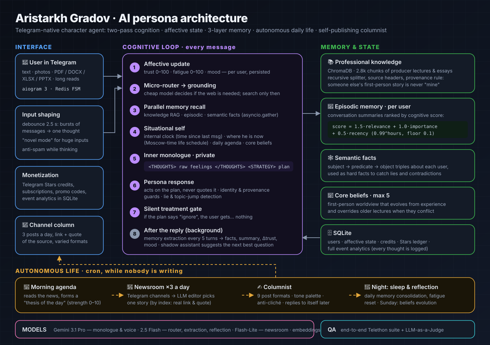

# Aristarkh Gradov — an AI persona that thinks before it speaks

A Telegram-native character agent: a cynical 55-year-old TV showrunner who has his own mood, remembers you, knows where he is right now, sometimes decides you are not worth an answer — and runs a Telegram channel on his own, two posts a day.

It is not a chatbot with a long system prompt. Every message goes through a small **cognitive loop**: affective state update → decision about grounding → parallel recall from three memory layers → situational self-awareness → a private inner monologue → a reply that acts on that monologue without ever quoting it. While nobody is writing, he **lives**: reads the news, forms a thesis of the day, writes columns, sleeps, consolidates memory and slowly evolves his beliefs.

> Aristarkh speaks Russian by default and switches to your language: write to him in English and he answers in English, with a Russian word or two for flavor. The interface follows your Telegram language. His channel posts in Russian: [@producer_gradov](https://t.me/producer_gradov).



<details>
<summary><b>What a channel post looks like</b> (sample output, translated from Russian)</summary>

> 🔗 News · @prbezposhady
> Quote: `OpenAI says the new model is "too advanced" to release; Anthropic's IPO prospectus warns about uncontrolled AI…`
>
> Hats off. Tech usually sells us a sterile future with smiling algorithms, but these guys found a real dramatic nerve. Selling shares with a promise of the apocalypse is top-tier work: fear converts to money faster than any positive agenda.
>
> As a producer I'd only crank it up. A prospectus is a tool for clerks. I'd stage a "leak" of engineers' night chats as they panic and try to cut the power. People won't buy this stock for dividends. They'll buy a front-row ticket to the end of the world.
>
> *Format: "Producer's fix" · tone: grudging respect*

</details>

---

## Why this project is interesting

| Technique | What it does | Where |
|---|---|---|
| **Two-pass cognition** | A private `<THOUGHTS>` / `<STRATEGY>` monologue runs first; the public reply is generated as a *performance of the plan*. A tolerant XML parser survives truncated tags. | `gemini.py`, `prompts.py` |
| **Affective state machine** | `trust`, `fatigue`, `mood` per user, persisted in SQLite. Fatigue grows with each message and resets during nightly "sleep"; trust and mood drift with memory consolidation. They shape length, tone and patience of replies. | `database.py`, `main.py` |
| **Three-layer memory** | *Knowledge* (ChromaDB, 2.8k chunks of producer lectures), *episodic* (per-user conversation summaries), *semantic* (subject → predicate → object facts). Recalled in parallel with `asyncio.gather`. | `rag_chroma.py`, `semantic_memory.py` |
| **Cognitive retrieval score** | Episodic memories are ranked like in *Generative Agents*: `1.5·relevance + 1.0·importance + 0.5·recency` with `0.99^hours` decay and a 0.1 floor, so old but important memories never vanish. | `rag_chroma.py` |
| **Cost-aware micro-router** | A cheap model decides whether a message needs the web at all. Small talk never pays for search; named films, people and fresh news always get grounded. | `gemini.py` |
| **Situational self** | An internal clock ("you vanished for three days") and a spatial simulator: where he is at this hour of a Moscow weekday or weekend, cached per hour so he doesn't teleport between messages. | `context_simulator.py`, `main.py` |
| **Persona integrity guards** | Identity lock, anti-fourth-wall rules, and **provenance rules**: someone else's first-person story from the knowledge base is never told as his own. | `prompts.py` |
| **Lie & topic-jump detection** | Changed facts ("the budget was 10M, not 5M") are cross-checked with semantic memory and called out; abrupt topic switches are noticed. | `prompts.py`, QA block 11 |
| **Silent treatment** | If the private plan says the user is not worth it, the reply is literally nothing. The history records that he ignored you. | `main.py` |
| **Autonomous life** | Morning agenda from the news with a self-assessed strength 0–10; nightly reflection and memory consolidation; weekly evolution of at most five core beliefs. | `morning_routine.py`, `worker_cron.py`, `evolution_engine.py` |
| **Self-publishing columnist** | Telegram channels → an LLM editor picks one story *by index* (so the link and quote are real, not hallucinated) → a post in one of 9 formats (from a two-line jab to a producer's thought experiment) with a tone palette, stop-list of clichés and a rewrite pass, header with source link and a collapsed quote. Every post closes with a practical takeaway in the author's own words, never a fixed label; a link to the bot every 4–5 posts can be switched on with `CHANNEL_BOT_CTA`. A topic filter keeps politics, religion, children and LGBT out. Forecasts can't land in the past. | `news_module/` |
| **Living columnist** | With a private persona file, the channel author has a day: a mood with inertia, a scene from his routine, real Moscow weather, memory of his own recent posts, a personal note on some Sundays, and human timing (random delays, rare skipped slots). Writes to `tg_news.json` go through a file lock. | `news_module/columnist.py` |
| **Subscriber Q&A** | The admin sends `/razbor <question>` to the bot, gets a ready post as a preview with buttons (publish / another take / cancel), and publishes it to the channel in one tap. | `aristarkh_core/main.py` |
| **Replies to himself** | A third of posts get a scheduled follow-up: 20 minutes to a day later he replies to his own post with a punchline, an afterthought or a bit of self-irony, like a real channel author. | `followup_cron.py` |
| **Speaks your language** | Replies in the language the user writes in; buttons, invoices and system messages follow the user's Telegram language (Russian or English). | `prompts.py`, `i18n.py`, `locales/` |
| **Human punctuation** | Deterministic post-processing, no tokens spent: em dashes, the tell-tale sign of machine text, become `-`, `=` or `:`, the way people actually type in messengers. | `humanize.py` |
| **Shadow assistant** | After each reply, a second agent suggests the user's next best question, grounded in a producer methodology. | `assistant.py` |
| **Production details** | Debounce that merges message bursts, "novel mode" for huge inputs, file parsing (PDF/DOCX/XLSX/PPTX), images, retries, JSON recovery for truncated LLM output, Telegram Stars payments, per-event analytics. | `main.py` |
| **LLM-as-a-Judge QA** | An end-to-end suite that talks to the live bot through a Telethon user account and lets an independent model grade persona stability, jailbreak resistance, memory and agenda handling. | `qa/qa_runner.py` |

## How one message flows

1. **Input shaping.** Messages sent within 2.5 s are merged into one thought; huge texts switch to accumulation mode.
2. **Affect.** Fatigue +5; current trust, fatigue and mood are loaded.
3. **Router.** A Flash model returns `{"needs_search": bool, "query": str}`; if needed, a grounded search collects fresh facts.
4. **Recall.** Knowledge, episodic and semantic memory are fetched in parallel.
5. **Situation.** Time since the last message, where he is right now, whether he may mention it, the thesis of the day, core beliefs.
6. **Inner monologue.** Pro model, private, in XML.
7. **Reply.** Pro model acts on the plan under persona, provenance and messenger-realism rules — or returns `[IGNORE]`.
8. **Afterwards.** Every 5 turns an extractor distills facts, a summary, Δtrust and mood into memory; the shadow assistant suggests a follow-up question.

## Use cases: take it as is or fork it

| You want… | What to change | Effort |
|---|---|---|
| **An expert persona for your brand** (coach, lawyer, doctor, chef) | Replace the biography and rules in `prompts.py` / `prompts/system_prompt_*.txt`, put your course or articles into `knowledge_base/` | an evening |
| **A mentor bot trained on your course** | Drop your lecture transcripts in, keep the provenance rules so the bot speaks *about* the methodology instead of pretending it lived your stories | an evening |
| **A paid consultation bot** | Keep Telegram Stars packages and promo codes, tune prices in `main.py` | minutes |
| **An autonomous Telegram channel with a voice** | Point `news_module/tg_news.py` to your source channels, rewrite the persona and post formats in `post_builder.py` | an evening |
| **A character companion / game NPC** | Keep the cognitive loop, affect and memory; replace the producer life schedule in `context_simulator.py` with your character's day | a weekend |
| **A research testbed for affective agents** | Log-rich pipeline: every inner monologue, affective update and memory write is stored — compare prompting strategies on real conversations | ready |
| **A QA harness for any persona bot** | Reuse `qa/qa_runner.py`: Telethon drives the real bot, an LLM judge scores the answers | an evening |

## Quick start

```bash
git clone https://github.com/alex-princeps/ai_producer.git && cd ai_producer
python3 -m venv .venv && . .venv/bin/activate
pip install -r requirements.txt
cp template.env .env             # TELEGRAM_TOKEN, GEMINI_API_KEY, ADMIN_ID, ...
# knowledge_base/demo/ ships with the repo; add your files next to it (.pdf .docx .txt .md)
PYTHONPATH=. python aristarkh_core/main.py
```

Aristarkh lives in Moscow: his daily schedule uses Europe/Moscow, so run cron in that timezone or change it.

```cron
0 2 * * *   cd aristarkh_core && PYTHONPATH=.. python worker_cron.py          # sleep, reflection, Sunday evolution
30 10,18 * * *   cd news_module && PYTHONPATH=.. python tg_news.py           # newsroom
35 10,18 * * *   cd news_module && PYTHONPATH=.. python publisher_cron.py    # columnist
50 * * * *  cd news_module && PYTHONPATH=.. python followup_cron.py           # replies to his own posts
```

`python news_module/publisher_cron.py --dry-run [--format twist]` writes a post without publishing it. How to plug in your own knowledge: [knowledge_base/README.md](knowledge_base/README.md).

## Project structure

```
aristarkh_core/   main.py (bot + cognitive loop) · gemini.py (LLM calls) · prompts.py (persona)
                  rag_chroma.py (knowledge + episodic memory) · semantic_memory.py · database.py
                  context_simulator.py · morning_routine.py · worker_cron.py · evolution_engine.py
                  assistant.py (shadow assistant, memory extractor, nightly reflection)
                  humanize.py (punctuation that doesn't scream "AI")
news_module/      tg_news.py (newsroom) · post_builder.py (columnist) · publisher_cron.py · followup_cron.py
knowledge_base/   demo/ (original MIT corpus) · README.md (bring your own knowledge)
qa/               qa_runner.py (end-to-end suite with LLM-as-a-Judge)
tools/            research_rag.py (RAG over research papers)
locales/          UI strings (en, ru), picked per user
docs/             architecture.svg · knowledge-pipeline.svg · RESEARCH.md (annotated reading list)
```

## What's next: Aristarkh 2.0

Version 1.0 is a persona engine. Version 2.0, in development, is a **cognitive architecture** built to be indistinguishable from a person in a messenger:

- OCC-based appraisal → emotions → mood → temperament, instead of three counters;
- seven memory layers with a **canon registry**: everything he ever said about himself is checked for contradictions *before* sending;
- a simulated daily life with plans, events, story arcs and a diary, identical for every person he talks to;
- one person with one life, but a separate relationship with each interlocutor;
- a test range of LLM-driven interlocutors with hidden goals and a calibrated LLM judge.

## Research foundations

Built on generative agents, persona consistency, theory of mind, appraisal-based emotion and agent memory research. Highlights:

- Park et al. — *Generative Agents* ([arXiv:2304.03442](https://arxiv.org/abs/2304.03442)): memory scoring and daily plans
- Kim et al. — *PICON* ([arXiv:2603.25620](https://arxiv.org/abs/2603.25620)): surviving interrogation about one's past
- Zhou et al. — *SOTOPIA* ([arXiv:2310.11667](https://arxiv.org/abs/2310.11667)): testers with hidden goals
- Croissant et al. — *Chain-of-Emotion* ([arXiv:2309.05076](https://arxiv.org/abs/2309.05076)): appraise first, feel second, speak third
- Amanlou et al. — *PsychoAgent* ([arXiv:2608.07438](https://arxiv.org/abs/2608.07438)): memories that remember how things felt
- Vezhnevets et al. — *Concordia* ([arXiv:2312.03664](https://arxiv.org/abs/2312.03664)): simulating a whole life around a character

📚 **Full annotated reading list, 40 papers with "why Aristarkh cares": [docs/RESEARCH.md](docs/RESEARCH.md)**

## Author

**Alexander Sokolov** — cognitive architectures and AI personas.

- ✉️ [sokolov.alexander.v@gmail.com](mailto:sokolov.alexander.v@gmail.com)
- 🌐 [myaistaff.tech](https://myaistaff.tech/)
- 💼 [linkedin.com/in/alexprinceps](https://www.linkedin.com/in/alexprinceps)
- ✈️ Telegram: [@alex_princeps](https://t.me/alex_princeps)

## License

[MIT](LICENSE) — fork it, ship it, give it a different personality. The demo knowledge base is original and MIT-licensed too; bring only content you have the right to use.
