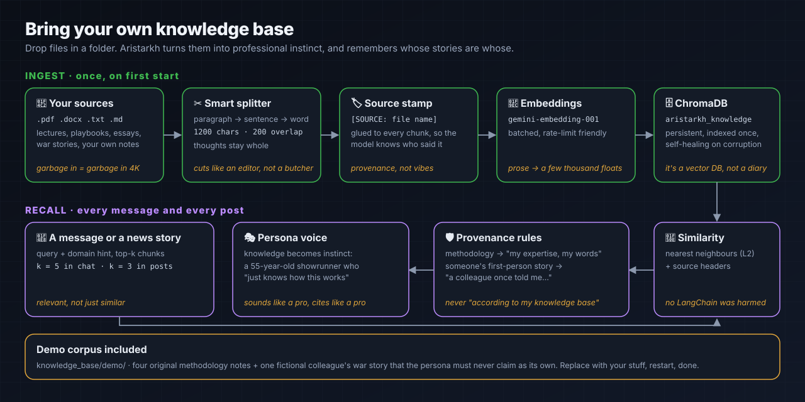

# Knowledge base: bring your own brain



Aristarkh without a knowledge base is a very confident man with no receipts. Give him your lectures, playbooks and war stories, and he starts talking like someone who has spent 25 years in the control room, without quoting your PDFs like a student defending a thesis.

## TL;DR

```bash
cp -r my_course_transcripts/ knowledge_base/my_stuff/   # .pdf .docx .txt .md
rm -rf aristarkh_core/chroma_db                         # only if you re-index an existing bot
PYTHONPATH=. python aristarkh_core/main.py              # indexes on first start, then just runs
```

Custom location: set `KNOWLEDGE_DIR=/abs/path/to/folder` in `.env`.

## What ships in this repo

`knowledge_base/demo/` is a tiny, original, MIT-licensed corpus. It is enough to see the mechanics, not enough to run a TV channel.

| File | Type | What it teaches the persona |
|---|---|---|
| `01_the_12_second_rule.md` | methodology | retention: something must happen every 12 seconds |
| `02_conflict_is_the_engine.md` | methodology | "who are we against?" and casting collisions |
| `03_money_talks.md` | methodology | the monetization ladder, from lead magnet to high ticket |
| `04_casting_archetypes.md` | methodology | the six roles every unscripted cast needs |
| `05_colleague_story_the_burnt_pilot.md` | **someone else's first-person story** | provenance: retell as "a colleague once told me…", never as "I" |

## How it works (no magic, some craft)

1. **Split like an editor.** A recursive splitter cuts by paragraph, then sentence, then word: 1200 characters with 200 of overlap. Thoughts stay whole instead of ending mid-sentence.
2. **Stamp every chunk.** `[SOURCE: file name]` is glued to each piece before embedding, so retrieval brings back *who* said it, not just *what*.
3. **Embed once.** `gemini-embedding-001`, batched and gentle with rate limits; the index lives in ChromaDB (`aristarkh_knowledge`) and is not rebuilt on every restart.
4. **Recall on demand.** Chat replies pull the top 5 chunks, channel posts the top 3. Only one post format, "Story", is allowed to retell an anecdote.
5. **Respect provenance.** The prompt rules turn methodology into the persona's own expertise ("here's how this works"), but someone else's first-person stories stay someone else's ("a colleague once told me…"). Breaking the fourth wall ("according to my knowledge base") is forbidden.

## Tips from people who learned the hard way

- **Curate, don't hoard.** 50 great pages beat 5,000 mediocre ones. Retrieval can't fix a boring corpus; it just finds boredom faster.
- **Name files like headlines.** The file name becomes the source stamp. `lecture_final_v3_REAL.pdf` teaches the model nothing.
- **Separate methodology from anecdotes.** Put first-person stories in their own files, and say in the first lines whose story it is.
- **Only use what you have the right to use.** Paid courses and other people's books do not become yours because they fit in a vector DB. Your lawyer and your reputation will thank you.

## Roadmap (Aristarkh 2.0)

In 2.0 provenance moves from prompt rules into the data. Every chunk carries a `source_type` (`method`, `story`, `style`, `own_research`, `world_method`, `news`), stories are detected and tagged at ingestion, and retrieval is hybrid: vector search plus full-text search, fused with RRF.
